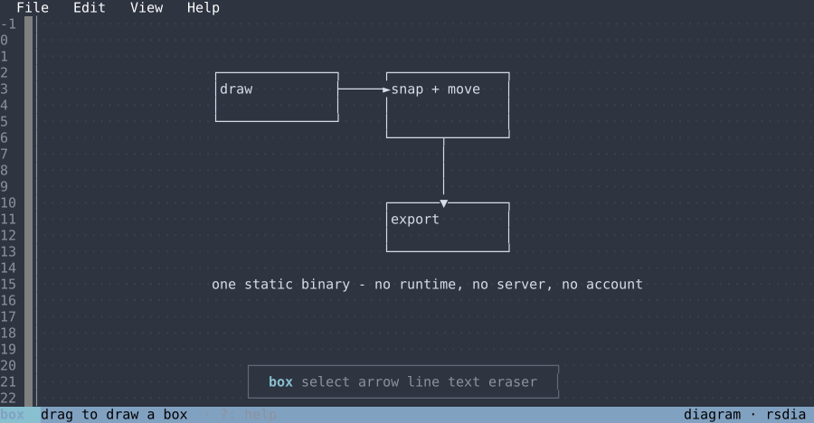

# rsdia

Draw ASCII diagrams in your terminal: boxes, arrows, lines and text, exported as
plain text. One static Rust binary — no runtime, no server, no account.

[](https://ioma8.github.io/rsdia/)

## Install

Prebuilt binaries for macOS, Linux and Windows, arm64 and x86_64, are on the
[releases page](https://github.com/ioma8/rsdia/releases), or:

```sh
cargo install --git https://github.com/ioma8/rsdia
```

macOS quarantines an unsigned download; one `xattr -d com.apple.quarantine ./rsdia`
clears it.

## Use

```sh
rsdia                       # open the last drawing, or create "untitled"
rsdia architecture          # open or create a drawing by name
rsdia --import notes.txt    # start from a text file
rsdia list                  # what is saved

rsdia export architecture --basic --comment hashes --fenced -o diagram.txt
```

| key | |
|---|---|
| `1`–`6`, `r v a l t e` | box, select, arrow, line, text, eraser |
| drag | draw; `f` flips a line or arrow elbow |
| arrows, `del` | nudge, erase the selection |
| `y` `x` `p` | copy, cut, paste the selection |
| wheel, middle-drag, space+drag | pan |
| `ctrl+z` `ctrl+y` | undo, redo |
| `ctrl+o` `ctrl+e` `ctrl+s` | drawings, export, save |
| `alt+f e v h` | the menus; arrows and `enter` walk them |
| `?` `esc` | help; close, cancel, deselect |
| `ctrl+c` `ctrl+q` | quit — the drawing is saved first |

Drawings are `.rd.json` under `~/.local/share/rsdia`, settings under
`~/.config/rsdia`, and both autosave. In `tmux`, set `set -g mouse on`; on macOS
use the bare digits instead of `alt`+digit. More screenshots are on the
[project page](https://ioma8.github.io/rsdia/).

## Develop

```sh
cargo test                  # golden fixtures from ASCIIFlow, spec files, end-to-end app tests
cargo clippy --all-targets  # strict: all, pedantic and nursery are denied, see Cargo.toml
cargo fmt
cargo run --example shots   # regenerate the screenshots
```

`src/core` is pure — no terminal, no I/O. `src/tui` is the ratatui front end,
`src/cli.rs` the command surface.

## Credits

The drawing logic is ported from [ASCIIFlow](https://github.com/lewish/asciiflow)
(MIT, © Lewis Hemens) and stays byte-compatible with its captured fixtures. rsdia
began as a Rust rewrite of a TypeScript editor built on it, and is
[MIT](https://github.com/ioma8/rsdia/blob/main/LICENSE).
